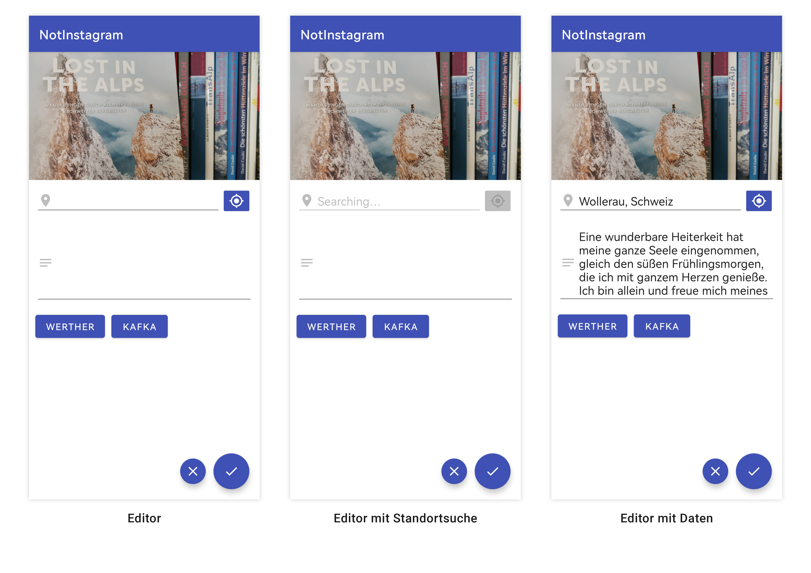
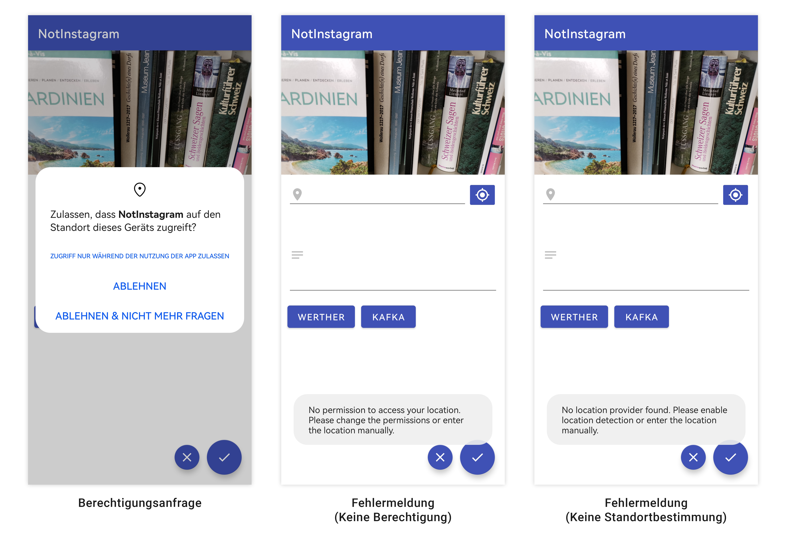

# Not-Instagram
Not-Instagram ist ein vereinfachter Instagram-Klon, welcher für das MGE-Miniprojekt 2022 entwickelt wurde.
Benutzer können mit dieser App Fotos aufnehmen und anschliessend zusammen mit einer Beschreibung und dem aktuellen Standort abspeichern.
Die aufgenommenen Bilder werden ausserdem in der Gallerie des Benutzers angezeigt.

## Punkteauflistung
So werden die verlangten **7 Punkte** erreicht:

- Verwendung von Kotlin statt Java (3 Punkte)
- Funktionalität der beiden Screens (2 Punkte)
- Persistenz der Einträge (1 Punkt)
- Verwendung der Standortbestimmung (1 Punkt)

## Screenshots

### Hauptansicht

### Editor

### Meldungen

