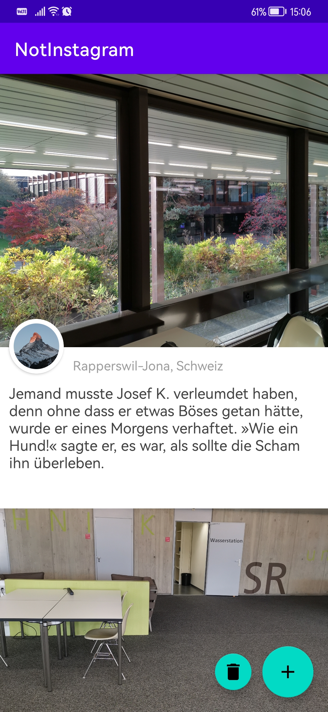
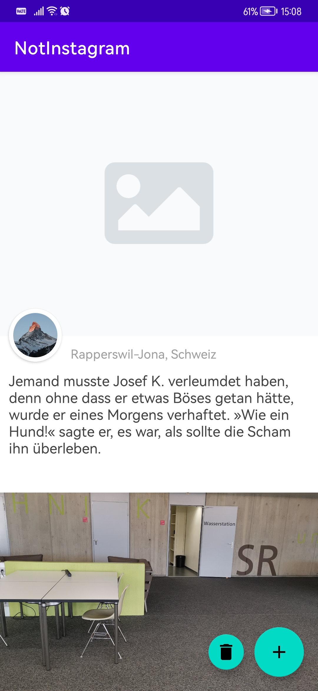
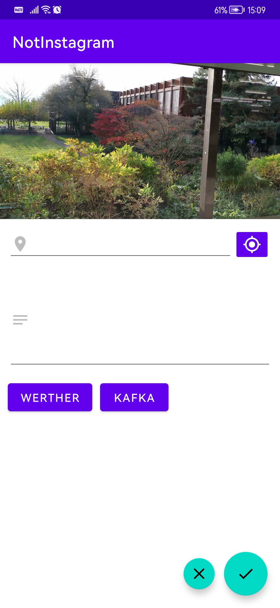
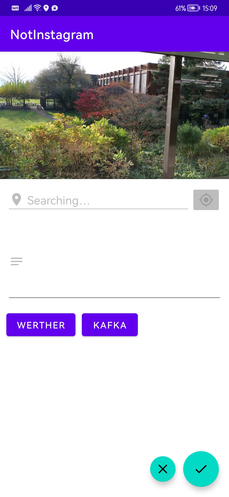
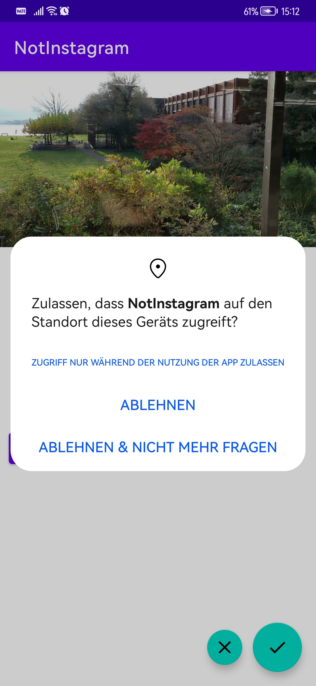
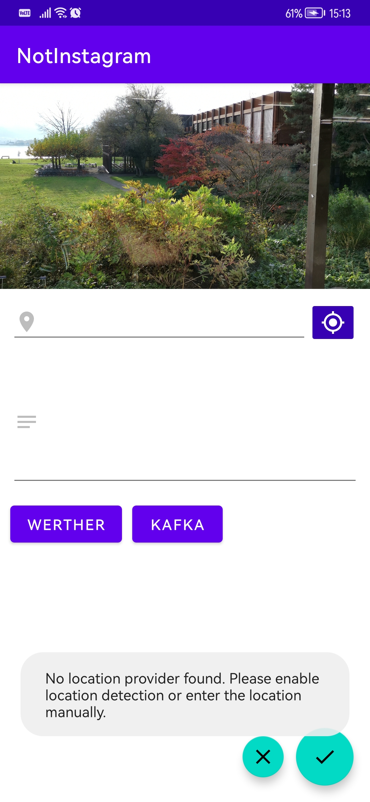

# Not-Instagram
Not-Instagram ist ein vereinfachter Instagram-Klon, welcher für das MGE-Miniprojekt 2022 entwickelt wurde. Benutzer können mit dieser App Fotos aufnehmen, diese bearbeiten und anschliessend zusammen mit einer Beschreibung und dem aktuellen Standort abspeichern.

## Punkteauflistung
So werden die verlangten **7 Punkte** erreicht:

- Verwendung von Kotlin statt Java (3 Punkte)
- Funktionalität der beiden Screens (2 Punkte)
- Persistenz der Einträge (1 Punkt)
- Verwendung der Standortbestimmung (1 Punkt)

## Screenshots

### Hauptansicht

<table style="border: none">
<tr>
<td>

</td>
<td>

</td>
</tr>
</table>

### Editor

### Meldungen

